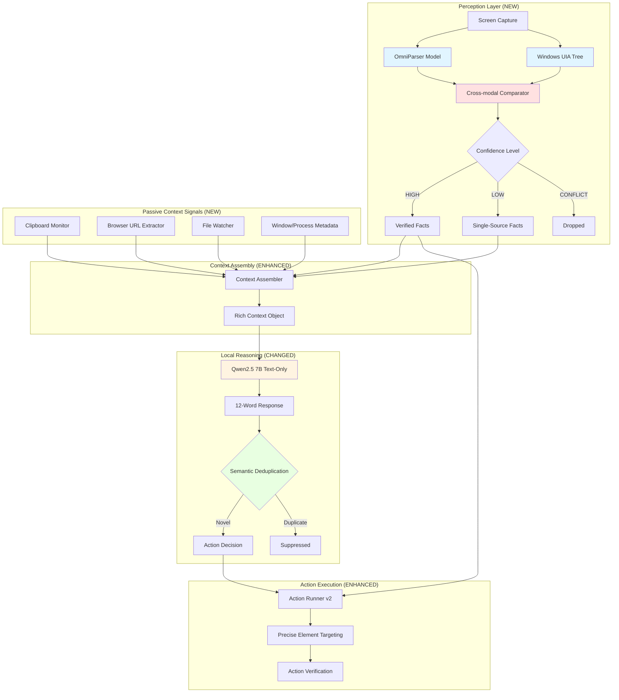
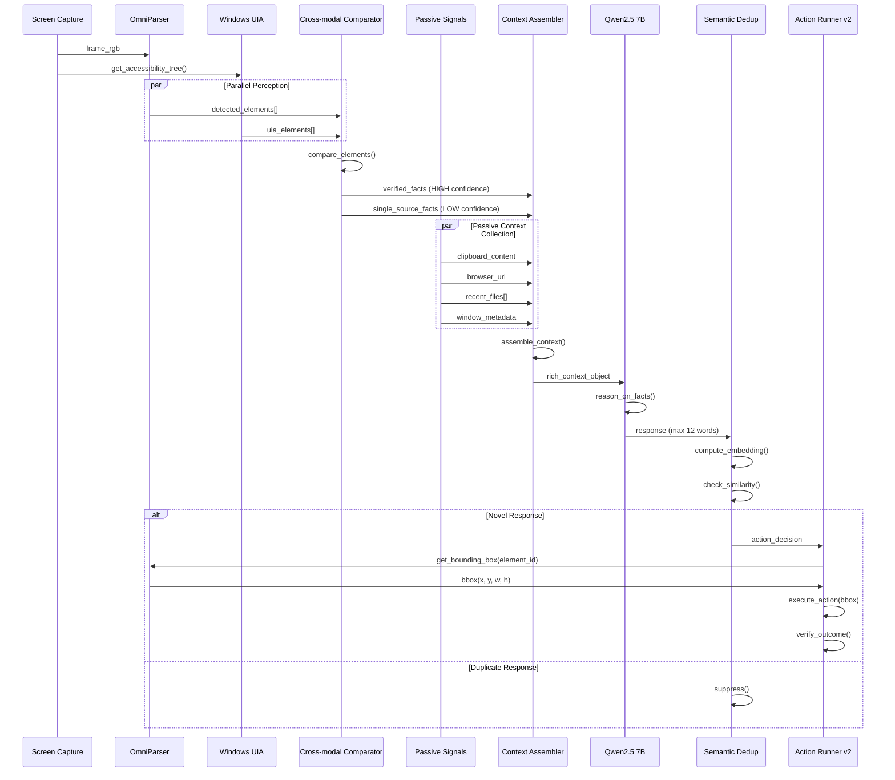

# Design Document: Verified Perception Layer

## Overview

The Verified Perception Layer transforms ARIA from a cloud-dependent vision model system to a fully local, zero-API architecture with verified perception. This design introduces cross-modal verification where OmniParser (Microsoft's open-source UI understanding model) detects interactive elements with bounding boxes, Windows UI Automation provides ground truth from the accessibility tree, and a Cross-modal Comparator verifies outputs before they proceed to reasoning. Only facts that both sources agree on are considered HIGH confidence. This eliminates hallucination by ensuring the LLM reasons on verified facts rather than raw screenshots.

The architecture also introduces passive context signals (clipboard monitoring, browser URL extraction, file watching, active window metadata) that enrich context without requiring vision inference. The local reasoning layer switches from llama3.2:3b to Qwen2.5 7B (text-only), as OmniParser handles all vision tasks. Semantic deduplication using sentence-transformers prevents paraphrased repeats, and Action Runner v2 uses OmniParser bounding boxes for precise element targeting.

## Architecture



## Sequence Diagrams

### Main Perception and Reasoning Flow



### Cross-modal Verification Process

```mermaid
sequenceDiagram
    participant OP as OmniParser
    participant UIA as Windows UIA
    participant CC as Comparator
    participant VF as Verified Facts Store
    
    OP->>CC: element{type:"button", text:"Submit", bbox:[100,200,80,30]}
    UIA->>CC: element{type:"button", name:"Submit", rect:[100,200,80,30]}
    
    CC->>CC: match_by_position(bbox, rect)
    CC->>CC: match_by_text("Submit", "Submit")
    CC->>CC: match_by_type("button", "button")
    
    alt All Criteria Match
        CC->>VF: store(element, confidence=HIGH)
        Note over VF: Both sources agree
    else Partial Match
        CC->>VF: store(element, confidence=LOW)
        Note over VF: Only one source reliable
    else Conflict
        CC->>CC: drop(element)
        Note over CC: Sources disagree, unsafe
    end
    else Conflict
        CC->>CC: drop(element)
        Note over CC: Sources disagree, unsafe
    end
```

## Components and Interfaces

### Component 1: OmniParser Model Wrapper

**Purpose**: Wraps Microsoft's OmniParser model for local UI element detection with bounding boxes

**Interface**:
```python
class OmniParserClient:
    def detect_elements(self, frame_rgb: np.ndarray) -> list[DetectedElement]:
        """
        Detect interactive UI elements in the screen frame.
        
        Returns list of elements with bounding boxes, types, and text labels.
        """
        pass
    
    def get_bounding_box(self, element_id: str) -> BoundingBox:
        """
        Retrieve precise bounding box for a detected element.
        """
        pass
```

**Responsibilities**:
- Load and manage OmniParser model locally
- Process screen frames to detect interactive elements
- Extract bounding boxes with pixel-perfect coordinates
- Classify element types (button, input, link, etc.)
- Extract visible text labels from elements

### Component 2: Windows UI Automation Adapter

**Purpose**: Interfaces with Windows UI Automation API to extract accessibility tree ground truth

**Interface**:
```python
class WindowsUIAAdapter:
    def get_accessibility_tree(self) -> list[UIAElement]:
        """
        Extract current accessibility tree from active window.
        
        Returns list of UIA elements with properties and positions.
        """
        pass
    
    def get_element_at_point(self, x: int, y: int) -> UIAElement | None:
        """
        Get UIA element at specific screen coordinates.
        """
        pass
```

**Responsibilities**:
- Query Windows UI Automation API
- Extract element hierarchy and properties
- Retrieve element positions and bounding rectangles
- Provide element names, types, and states
- Handle UIA API errors gracefully

### Component 3: Cross-modal Comparator

**Purpose**: Verifies OmniParser output against UIA ground truth and assigns confidence levels

**Interface**:
```python
class CrossModalComparator:
    def compare_elements(
        self,
        omniparser_elements: list[DetectedElement],
        uia_elements: list[UIAElement]
    ) -> VerificationResult:
        """
        Compare elements from both sources and assign confidence levels.
        
        Returns verified facts with HIGH/LOW/CONFLICT confidence.
        """
        pass
    
    def match_by_position(
        self,
        bbox: BoundingBox,
        rect: Rectangle,
        tolerance: int = 10
    ) -> bool:
        """
        Check if bounding box and rectangle overlap within tolerance.
        """
        pass
```

**Responsibilities**:
- Match elements by position (bounding box overlap)
- Match elements by text content (fuzzy string matching)
- Match elements by type (button, input, etc.)
- Assign confidence levels: HIGH (all match), LOW (partial), CONFLICT (disagree)
- Filter out conflicting elements

### Component 4: Passive Context Signals Collector

**Purpose**: Collects passive context signals without requiring vision inference

**Interface**:
```python
class PassiveContextCollector:
    def get_clipboard_content(self) -> str | None:
        """
        Get current clipboard text content.
        """
        pass
    
    def get_browser_url(self) -> str | None:
        """
        Extract URL from active browser window.
        """
        pass
    
    def get_recent_files(self, window_seconds: int = 60) -> list[str]:
        """
        Get list of recently modified files.
        """
        pass
    
    def get_window_metadata(self) -> WindowMetadata:
        """
        Get active window and process metadata.
        """
        pass
```

**Responsibilities**:
- Monitor clipboard for copied text (errors, URLs, etc.)
- Extract browser URLs from window titles or browser APIs
- Watch file system for recently modified files
- Collect active window title, process name, and metadata
- Throttle collection to avoid performance impact

### Component 5: Context Assembler

**Purpose**: Combines verified facts and passive signals into rich context object for reasoning

**Interface**:
```python
class ContextAssembler:
    def assemble_context(
        self,
        verified_facts: list[VerifiedElement],
        passive_signals: PassiveSignals
    ) -> RichContext:
        """
        Assemble rich context object from all sources.
        
        Returns structured context with verified facts and signals.
        """
        pass
    
    def serialize_for_llm(self, context: RichContext) -> str:
        """
        Serialize context into text format for LLM consumption.
        """
        pass
```

**Responsibilities**:
- Merge verified facts from perception layer
- Integrate passive context signals
- Structure context into LLM-friendly format
- Prioritize HIGH confidence facts over LOW confidence
- Limit context size to prevent token overflow

### Component 6: Semantic Deduplication Engine

**Purpose**: Prevents paraphrased repeat responses using embedding-based similarity

**Interface**:
```python
class SemanticDeduplicator:
    def __init__(self, model_name: str = "all-MiniLM-L6-v2"):
        """
        Initialize with sentence-transformers model.
        """
        pass
    
    def is_duplicate(
        self,
        response: str,
        threshold: float = 0.85
    ) -> bool:
        """
        Check if response is semantically similar to recent responses.
        
        Returns True if similarity exceeds threshold.
        """
        pass
    
    def add_to_history(self, response: str) -> None:
        """
        Add response to deduplication history.
        """
        pass
```

**Responsibilities**:
- Compute sentence embeddings using sentence-transformers
- Compare new response embeddings to recent history
- Detect semantic similarity above threshold
- Maintain rolling window of recent responses
- Clear history periodically to prevent memory growth

## Data Models

### DetectedElement

```python
@dataclass
class DetectedElement:
    element_id: str
    element_type: str  # button, input, link, text, image, etc.
    text_label: str
    bbox: BoundingBox
    confidence: float  # OmniParser's detection confidence
    attributes: dict[str, Any]
```

**Validation Rules**:
- element_id must be unique within detection batch
- element_type must be from predefined set
- bbox coordinates must be non-negative
- confidence must be between 0.0 and 1.0

### UIAElement

```python
@dataclass
class UIAElement:
    control_type: str  # UIA control type
    name: str
    automation_id: str
    rect: Rectangle
    is_enabled: bool
    is_offscreen: bool
    properties: dict[str, Any]
```

**Validation Rules**:
- control_type must be valid UIA control type
- rect coordinates must be non-negative
- name should not be empty for interactive elements

### VerifiedElement

```python
@dataclass
class VerifiedElement:
    element_id: str
    element_type: str
    text: str
    bbox: BoundingBox
    confidence_level: Literal["HIGH", "LOW"]
    sources: list[Literal["omniparser", "uia"]]
    verification_metadata: dict[str, Any]
```

**Validation Rules**:
- confidence_level must be HIGH or LOW (CONFLICT elements are dropped)
- sources must contain at least one source
- HIGH confidence requires both sources present
- LOW confidence requires exactly one source

### PassiveSignals

```python
@dataclass
class PassiveSignals:
    clipboard_content: str | None
    browser_url: str | None
    recent_files: list[str]
    window_metadata: WindowMetadata
    timestamp: float
```

**Validation Rules**:
- timestamp must be recent (within last 5 seconds)
- recent_files should be limited to 10 most recent
- clipboard_content should be truncated to 500 chars

### RichContext

```python
@dataclass
class RichContext:
    verified_elements: list[VerifiedElement]
    passive_signals: PassiveSignals
    session_goal: str | None
    user_name: str
    project_name: str | None
    timestamp: float
```

**Validation Rules**:
- verified_elements should prioritize HIGH confidence
- timestamp must match passive_signals timestamp
- Total serialized size should not exceed 4000 tokens

### BoundingBox

```python
@dataclass
class BoundingBox:
    x: int  # top-left x coordinate
    y: int  # top-left y coordinate
    width: int
    height: int
```

**Validation Rules**:
- All values must be non-negative
- width and height must be positive
- Coordinates must be within screen bounds

## Error Handling

### Error Scenario 1: OmniParser Model Load Failure

**Condition**: OmniParser model fails to load at startup
**Response**: Log error, fall back to UIA-only mode with reduced confidence
**Recovery**: Retry model load on next perception cycle, alert user if persistent

### Error Scenario 2: UIA API Unavailable

**Condition**: Windows UI Automation API is unavailable or throws exceptions
**Response**: Log error, fall back to OmniParser-only mode with LOW confidence
**Recovery**: Retry UIA access on next cycle, continue with degraded perception

### Error Scenario 3: No Elements Detected

**Condition**: Both OmniParser and UIA return empty element lists
**Response**: Skip perception cycle, rely on passive signals only
**Recovery**: Continue monitoring, resume perception when elements detected

### Error Scenario 4: Clipboard Access Denied

**Condition**: Clipboard monitoring fails due to permissions or locked clipboard
**Response**: Log warning, continue without clipboard signal
**Recovery**: Retry clipboard access on next cycle, graceful degradation

### Error Scenario 5: Semantic Deduplication Model Load Failure

**Condition**: sentence-transformers model fails to load
**Response**: Fall back to exact string matching deduplication
**Recovery**: Retry model load in background, continue with degraded dedup

### Error Scenario 6: Context Assembly Timeout

**Condition**: Context assembly takes longer than threshold (e.g., 2 seconds)
**Response**: Cancel assembly, use cached context from previous cycle
**Recovery**: Log timeout, investigate slow components, optimize next cycle

## Testing Strategy

### Unit Testing Approach

Each component will have isolated unit tests with mocked dependencies:

- **OmniParserClient**: Mock model inference, test element detection parsing
- **WindowsUIAAdapter**: Mock UIA API calls, test tree extraction logic
- **CrossModalComparator**: Test matching algorithms with synthetic element pairs
- **PassiveContextCollector**: Mock system APIs, test signal collection
- **ContextAssembler**: Test context merging and serialization logic
- **SemanticDeduplicator**: Test embedding computation and similarity detection

Coverage goal: 85% line coverage for all components

### Property-Based Testing Approach

**Property Test Library**: hypothesis (Python)

Key properties to test:

1. **Cross-modal Comparator Symmetry**: If element A matches element B, then element B matches element A
2. **Bounding Box Overlap Transitivity**: If bbox A overlaps B and B overlaps C, then A overlaps C (within tolerance)
3. **Confidence Level Monotonicity**: Adding more matching criteria never decreases confidence level
4. **Context Assembly Idempotence**: Assembling same inputs twice produces identical output
5. **Semantic Deduplication Consistency**: Same response always produces same embedding

### Integration Testing Approach

End-to-end integration tests with real components:

1. **Perception Pipeline**: Capture real screen, run through OmniParser + UIA + Comparator
2. **Context Assembly**: Verify complete flow from perception to rich context
3. **Action Execution**: Test bounding box retrieval and action targeting
4. **Degradation Modes**: Test fallback behavior when components fail

## Performance Considerations

**OmniParser Inference Latency**: Target <500ms per frame on GPU, <2s on CPU
- Optimization: Downsample frames to 1280x720 before inference
- Optimization: Batch multiple frames if queue builds up

**UIA Tree Extraction**: Target <100ms per query
- Optimization: Cache tree for 500ms, only refresh on window change
- Optimization: Limit tree depth to 5 levels for active window

**Cross-modal Comparison**: Target <50ms for typical element counts (10-50 elements)
- Optimization: Use spatial indexing (R-tree) for position matching
- Optimization: Early exit on first conflict for CONFLICT classification

**Semantic Deduplication**: Target <100ms per response
- Optimization: Use lightweight model (all-MiniLM-L6-v2, 80MB)
- Optimization: Limit history window to 20 most recent responses

**Overall Perception Cycle**: Target <1s end-to-end (capture to context ready)
- Current baseline: ~3s with Gemini API calls
- Expected improvement: 60-70% latency reduction

## Security Considerations

**Clipboard Content Exposure**: Clipboard may contain sensitive data (passwords, tokens)
- Mitigation: Filter clipboard content for common secret patterns
- Mitigation: Truncate clipboard to 500 chars, redact PII
- Mitigation: User opt-out flag for clipboard monitoring

**Browser URL Tracking**: URLs may reveal sensitive browsing activity
- Mitigation: Hash URLs before logging to audit trail
- Mitigation: Blocklist for sensitive domains (banking, health, etc.)
- Mitigation: User opt-out flag for URL extraction

**File System Watching**: File paths may reveal project structure
- Mitigation: Only track files in user-approved directories
- Mitigation: Exclude system directories and hidden files
- Mitigation: Limit to 10 most recent files

**UIA Tree Exposure**: Accessibility tree may contain sensitive form data
- Mitigation: Redact password fields and secure input elements
- Mitigation: Filter out elements marked as sensitive by application
- Mitigation: Never log raw UIA tree to audit trail

**Model Inference Privacy**: All inference happens locally, no API calls
- Benefit: Zero data leaves the machine
- Benefit: No API key management or rate limiting
- Benefit: Works offline

## Dependencies

**New Dependencies**:
- `omniparser`: Microsoft's OmniParser model (local inference)
- `sentence-transformers`: Semantic similarity for deduplication
- `watchdog`: File system monitoring
- `pyperclip`: Clipboard access
- `comtypes` or `pywinauto`: Windows UI Automation API bindings

**Changed Dependencies**:
- `ollama`: Update to support Qwen2.5 7B model
- Remove: `google-generativeai` (Gemini API client, no longer needed)

**Existing Dependencies** (unchanged):
- `numpy`: Array operations
- `mss`: Screen capture
- `pillow`: Image processing
- `pydantic`: Data validation

**Model Downloads**:
- OmniParser model weights (~1.5GB)
- sentence-transformers model: all-MiniLM-L6-v2 (~80MB)
- Qwen2.5 7B model via Ollama (~4.7GB)

**System Requirements**:
- Windows 10/11 (for UI Automation API)
- 16GB RAM minimum (8GB for models, 8GB for system)
- GPU recommended for OmniParser (CUDA or DirectML)
- 10GB disk space for models

## Correctness Properties

### Property 1: Verified Perception Soundness
**Statement**: For all verified elements with HIGH confidence, both OmniParser and UIA must agree on element type, position (within tolerance), and text content.

**Formal Expression**:
```
∀ element ∈ verified_elements:
  element.confidence_level = HIGH ⟹
    (element.sources = ["omniparser", "uia"] ∧
     position_match(element.bbox, element.uia_rect, tolerance=10) ∧
     text_match(element.text, element.uia_name, threshold=0.9) ∧
     type_match(element.element_type, element.uia_control_type))
```

### Property 2: Zero Hallucination Guarantee
**Statement**: The LLM reasoning layer receives only verified facts and passive signals, never raw screenshots or unverified vision model outputs.

**Formal Expression**:
```
∀ reasoning_input ∈ llm_inputs:
  reasoning_input.contains_screenshot = false ∧
  reasoning_input.contains_unverified_vision_output = false ∧
  (∀ fact ∈ reasoning_input.facts:
    fact.confidence_level ∈ {HIGH, LOW} ∧
    fact.sources ≠ ∅)
```

### Property 3: Semantic Deduplication Correctness
**Statement**: A response is suppressed if and only if its semantic similarity to any recent response exceeds the threshold.

**Formal Expression**:
```
∀ response ∈ responses:
  is_suppressed(response) ⟺
    ∃ recent_response ∈ recent_history:
      cosine_similarity(embed(response), embed(recent_response)) > threshold
```

### Property 4: Bounding Box Precision
**Statement**: All action executions use bounding boxes from verified HIGH confidence elements, ensuring pixel-perfect targeting.

**Formal Expression**:
```
∀ action ∈ executed_actions:
  action.uses_bounding_box ⟹
    (∃ element ∈ verified_elements:
      element.confidence_level = HIGH ∧
      action.bbox = element.bbox ∧
      bbox_within_screen_bounds(action.bbox))
```

### Property 5: Passive Signal Freshness
**Statement**: All passive signals used in context assembly must be collected within the last 5 seconds to ensure relevance.

**Formal Expression**:
```
∀ context ∈ assembled_contexts:
  (current_time - context.passive_signals.timestamp) ≤ 5.0 ∧
  (current_time - context.timestamp) ≤ 1.0
```

### Property 6: Confidence Level Monotonicity
**Statement**: Adding more matching criteria (position, text, type) never decreases the confidence level of an element.

**Formal Expression**:
```
∀ element, criteria_set_1, criteria_set_2:
  criteria_set_1 ⊆ criteria_set_2 ⟹
    confidence(element, criteria_set_1) ≤ confidence(element, criteria_set_2)
```

### Property 7: Local-Only Execution
**Statement**: The entire perception and reasoning pipeline executes locally with zero external API calls.

**Formal Expression**:
```
∀ perception_cycle ∈ cycles:
  perception_cycle.api_calls = ∅ ∧
  perception_cycle.network_requests = ∅ ∧
  perception_cycle.models_local = true
```
