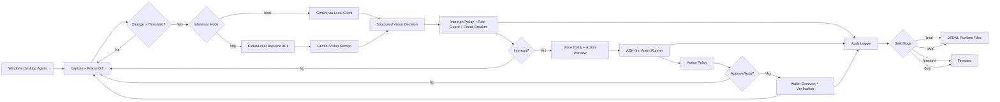

# ScreenSense Architecture

```mermaid
flowchart LR
    A[Windows Desktop Agent] --> B[Capture + Frame Diff]
    B --> C{Change > Threshold?}
    C -- No --> B
    C -- Yes --> D{Inference Mode}
    D -- local --> E[Gemini via Local Client]
    D -- http --> F[Cloud/Local Backend API]
    F --> G[Gemini Vision Service]
    E --> H[Structured Vision Decision]
    G --> H
    H --> I[Interrupt Policy + Rate Guard + Circuit Breaker]
    I --> J{Interrupt?}
    J -- No --> B
    J -- Yes --> K[Voice Notify + Action Preview]
    K --> L[ADK-first Agent Runner]
    L --> M[Action Policy]
    M --> N{Approve/Auto?}
    N -- No --> B
    N -- Yes --> O[Action Executor + Verification]
    O --> B

    I --> P[Audit Logger]
    L --> P
    O --> P
    P --> Q{Sink Mode}
    Q -- local --> R[JSONL Runtime Files]
    Q -- firestore --> S[Firestore]
    Q -- dual --> R
    Q -- dual --> S
```

